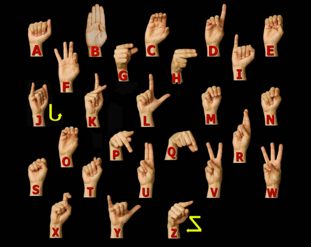

# Sign Language Translator

Sign Language Translator adalah project Computer Vision berbasis Python untuk mendeteksi gesture tangan dari webcam secara real-time, lalu menerjemahkan hasil prediksi menjadi teks di layar. Project ini dibuat sebagai alur end-to-end: mulai dari pengumpulan dataset menggunakan kamera, training model klasifikasi gesture, prediksi langsung, sampai penyimpanan riwayat hasil prediksi.

Project ini cocok untuk portfolio karena menunjukkan penerapan OpenCV, MediaPipe Hands, feature extraction, machine learning dengan Scikit-learn, dan integrasi aplikasi real-time.

## Referensi Gesture

Gambar berikut digunakan sebagai referensi visual untuk bentuk tangan alfabet ASL/Fingerspelling.

<p align="center">
  
</p>

Catatan penting:

- Model tidak otomatis mengenali semua huruf hanya dari gambar di atas.
- Model mengenali gesture berdasarkan dataset yang kamu kumpulkan sendiri.
- Huruf seperti `J` dan `Z` memiliki gerakan dinamis. Versi project ini membaca pose tangan per frame, sehingga gesture dinamis akan lebih baik jika dikembangkan dengan model sequence/time-series.

## Fitur Utama

- Deteksi tangan real-time dari webcam.
- Tracking 21 landmark tangan menggunakan MediaPipe Hands.
- Ekstraksi fitur landmark menjadi data numerik yang ringan.
- Training model klasifikasi gesture menggunakan Random Forest dari Scikit-learn.
- Prediksi gesture langsung di window kamera.
- Smoothing prediksi agar hasil tidak mudah berubah-ubah.
- Auto text untuk menambahkan gesture stabil ke kalimat terjemahan.
- Dukungan tangan kanan dan kiri melalui mirror augmentation.
- Logging hasil prediksi stabil ke file CSV.
- Error handling jika kamera, dataset, atau model belum tersedia.
- Bisa dijalankan di laptop tanpa GPU.

## Teknologi

- Python
- OpenCV
- MediaPipe
- NumPy
- Pandas
- Scikit-learn
- Joblib

## Cara Kerja Project

Alur kerja project ini terdiri dari empat tahap:

1. Kamera membaca tangan pengguna secara real-time.
2. MediaPipe Hands mendeteksi 21 titik landmark pada tangan.
3. Landmark dinormalisasi agar model fokus pada bentuk tangan, bukan posisi tangan di layar.
4. Model machine learning memprediksi label gesture, lalu aplikasi menampilkan hasilnya sebagai teks.

Dataset utama sudah disertakan di GitHub agar project bisa langsung digunakan untuk training ulang. Model hasil training tidak disimpan ke repository, sehingga pengguna tetap perlu menjalankan `python train_model.py` setelah clone.

## Struktur Project

```text
Sign Language Translator/
|-- app.py
|-- collect_dataset.py
|-- collect_l_to_z.py
|-- collect_l_to_z.ps1
|-- train_model.py
|-- predict.py
|-- requirements.txt
|-- README.md
|-- assets/
|   `-- asl-finger-chart.png
|-- dataset/
|   `-- .gitkeep
|-- model/
|   `-- .gitkeep
`-- logs/
    `-- .gitkeep
```

Keterangan file utama:

- `app.py`: menjalankan aplikasi real-time translator dari webcam.
- `collect_dataset.py`: mengumpulkan sample gesture dan menyimpannya ke CSV.
- `collect_l_to_z.py`: helper untuk mengumpulkan huruf `L` sampai `Z` secara berurutan.
- `train_model.py`: melatih model klasifikasi dari dataset yang sudah dikumpulkan.
- `predict.py`: berisi fungsi ekstraksi fitur dan prediksi model.
- `requirements.txt`: daftar dependency Python.

## Instalasi

Clone repository:

```bash
git clone https://github.com/FanyaDs/sign-language-translator.git
cd sign-language-translator
```

Buat virtual environment:

```bash
python -m venv .venv
```

Aktifkan virtual environment di Windows:

```bash
.venv\Scripts\activate
```

Aktifkan virtual environment di macOS/Linux:

```bash
source .venv/bin/activate
```

Install dependency:

```bash
pip install -r requirements.txt
```

## Mengumpulkan Dataset

Kumpulkan data untuk setiap label gesture yang ingin dikenali. Contoh untuk alfabet:

```bash
python collect_dataset.py --label A --samples 120
python collect_dataset.py --label B --samples 120
python collect_dataset.py --label C --samples 120
```

Contoh untuk gesture berupa kata/frasa:

```bash
python collect_dataset.py --label Hello --samples 120
python collect_dataset.py --label "Thank You" --samples 120
python collect_dataset.py --label "I Love You" --samples 120
```

Saat window kamera terbuka:

- Arahkan satu tangan ke kamera.
- Pastikan tangan terlihat jelas dan tidak terlalu dekat.
- Tekan `SPACE` untuk menyimpan satu sample.
- Tekan `Q` atau `ESC` untuk keluar.

Mode otomatis juga tersedia:

```bash
python collect_dataset.py --label A --samples 120 --auto --interval 0.2
```

Dataset akan tersimpan di:

```text
dataset/gesture_dataset.csv
```

Jika ingin mengumpulkan huruf `L` sampai `Z` secara berurutan, jalankan:

```bash
python collect_l_to_z.py --samples 120
```

Untuk mode otomatis:

```bash
python collect_l_to_z.py --samples 120 --auto --interval 0.2
```

## Tips Dataset Agar Akurat

- Ambil minimal 80 sampai 150 sample untuk setiap label.
- Gunakan variasi jarak tangan dari kamera.
- Gunakan variasi posisi tangan: tengah, kiri, kanan, atas, dan bawah.
- Ambil data di beberapa kondisi cahaya.
- Gunakan label yang konsisten, misalnya selalu `I Love You`, bukan bergantian dengan `ILY`.
- Gunakan satu tangan saja di dalam frame saat mengumpulkan sample.
- Tambahkan sample dari tangan kanan dan kiri jika ingin hasil lebih kuat.
- Untuk huruf yang mirip, seperti `M`, `N`, `S`, dan `T`, ambil sample lebih banyak agar model lebih mudah membedakan.

## Training Model

Setelah dataset terkumpul, jalankan:

```bash
python train_model.py
```

Output training:

```text
model/sign_language_model.pkl
model/training_report.txt
```

Secara default, training menambahkan mirror augmentation agar gesture dapat dikenali dari tangan kanan maupun kiri. Jika ingin mematikan fitur tersebut:

```bash
python train_model.py --no-mirror-augment
```

Jika dataset masih kecil, report training akan memberi catatan bahwa evaluasi belum ideal. Tambahkan sample per label agar akurasi lebih stabil.

## Menjalankan Aplikasi

Jalankan aplikasi real-time:

```bash
python app.py
```

Jika window kamera terlalu besar, gunakan ukuran display yang lebih kecil:

```bash
python app.py --no-fullscreen --display-width 960 --display-height 540
```

Jika kamera default tidak terdeteksi, coba index kamera lain:

```bash
python app.py --camera 1
```

Kontrol aplikasi:

- `SPACE`: menambahkan prediksi stabil ke teks.
- `ENTER`: menambahkan spasi antar kata.
- `BACKSPACE`: menghapus token terakhir.
- `C`: membersihkan teks.
- `Q` atau `ESC`: keluar dari aplikasi.

Riwayat prediksi stabil tersimpan di:

```text
logs/gesture_history.csv
```

## Troubleshooting

Jika kamera tidak terbuka:

- Tutup aplikasi lain yang memakai kamera, seperti Zoom, Google Meet, OBS, atau browser.
- Coba jalankan dengan `--camera 1`.
- Periksa permission kamera di sistem operasi.
- Coba webcam eksternal jika kamera laptop tidak terbaca.

Jika model belum terbaca:

- Pastikan dataset sudah dibuat di `dataset/gesture_dataset.csv`.
- Jalankan `python train_model.py`.
- Pastikan file `model/sign_language_model.pkl` berhasil dibuat.

Jika prediksi kurang akurat:

- Tambahkan jumlah sample untuk label yang sering salah.
- Ambil sample dengan pencahayaan yang lebih stabil.
- Hindari background yang terlalu ramai.
- Pastikan pose tangan saat testing mirip dengan variasi saat pengumpulan dataset.

## Catatan Untuk GitHub

Dataset utama berikut ikut disimpan di repository:

- `dataset/gesture_dataset.csv`

File berikut sengaja tidak diupload ke repository:

- `.venv/`
- `logs/*.csv`
- `model/*.pkl`
- `model/*.joblib`
- `model/training_report.txt`

Alasannya, file tersebut adalah environment lokal, log, atau hasil generate training yang dapat dibuat ulang dengan menjalankan `python train_model.py`.

## Lisensi Dan Penggunaan

Project ini dipublikasikan untuk portfolio, referensi pembelajaran, dan evaluasi lokal. Orang lain boleh melihat source code dan menjalankan project secara lokal, tetapi tidak diperbolehkan menyalin ulang, mengupload ulang, menjual, memodifikasi, atau mengklaim project ini sebagai milik sendiri tanpa izin tertulis dari pemilik repository.

Lihat detail pada file `LICENSE`.

## Contoh Deskripsi Untuk CV

Versi bahasa Inggris:

```text
Developed a real-time Sign Language Translator using Python, OpenCV, MediaPipe Hands, and Scikit-learn, including webcam-based data collection, hand landmark feature extraction, gesture classification training, live inference, and CSV prediction logging.
```

Versi bahasa Indonesia:

```text
Mengembangkan aplikasi Sign Language Translator real-time menggunakan Python, OpenCV, MediaPipe Hands, dan Scikit-learn, mencakup pengumpulan dataset dari webcam, ekstraksi fitur landmark tangan, training model klasifikasi gesture, inference langsung, dan logging hasil prediksi ke CSV.
```

## Ide Pengembangan Lanjutan

- Menambahkan dataset lengkap alfabet `A` sampai `Z`.
- Menambahkan gesture kata sehari-hari seperti `Hello`, `Thank You`, `Yes`, dan `No`.
- Menggunakan model sequence untuk gesture dinamis seperti `J`, `Z`, `Hello`, atau `Thank You`.
- Menambahkan GUI dengan Streamlit, PyQt, atau web app.
- Menambahkan dashboard metrik training.
- Menambahkan mode kalibrasi kamera.
- Export model ke format yang lebih ringan untuk deployment.

## Kredit Gambar

Gambar referensi alfabet ASL/Fingerspelling berasal dari chart William Vicars/Lifeprint yang ditampilkan pada artikel [Kathleen Ink](https://kathleen-ink.com/nudged-learn-how-to-sign-a-fun-phrase-in-american-sign-language/).
